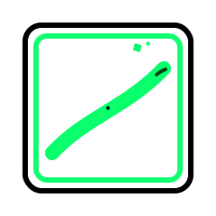
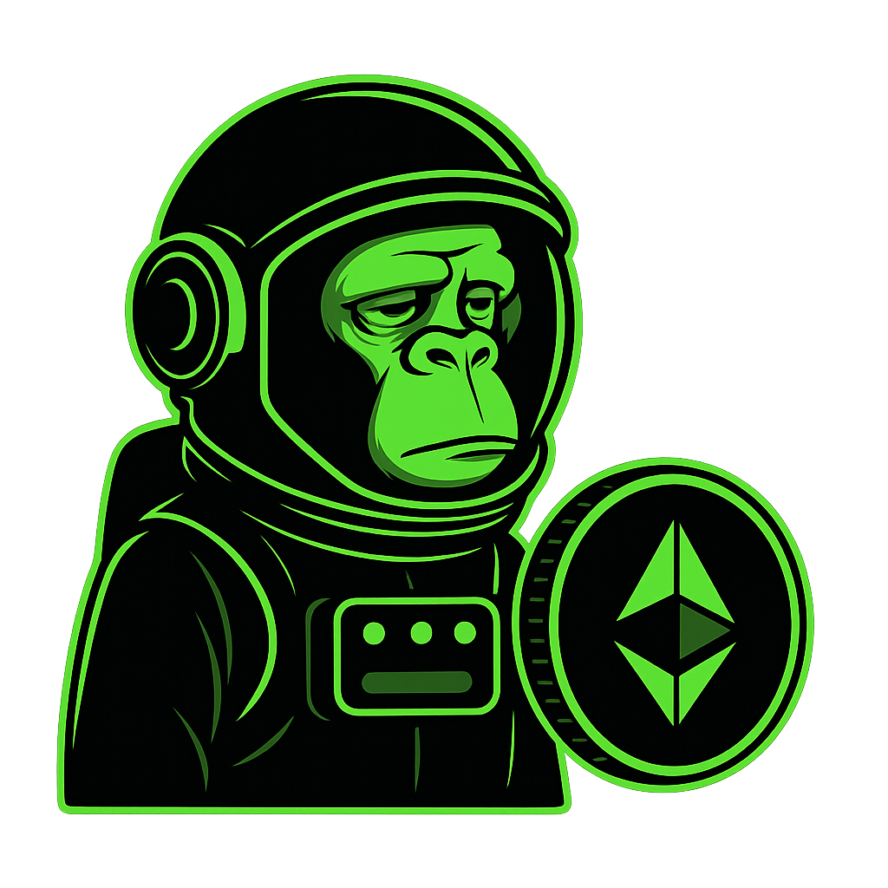
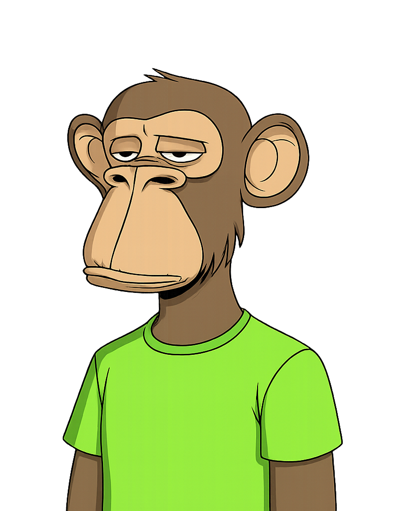
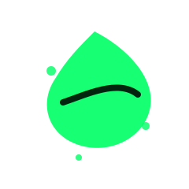

<div align="center">
  
</div>

<div align="center">
  
  # CryptoCanvas 🎨
  
  <p><strong>A decentralized NFT marketplace platform where digital artists can mint, showcase, and trade their artwork as NFTs.</strong></p>
  
  <p>Built with modern web3 technologies and featuring a comprehensive smart contract backend with 100% test coverage.</p>
  
  [](https://soliditylang.org/)
  [](https://book.getfoundry.sh/)
  [](./contract/README.md)
  [](./LICENSE)
  
</div>

---

## 🖼️ Visual Showcase

<div align="center">
  <h3>🎨 Project Gallery</h3>
  <p><em>Explore the visual elements of CryptoCanvas</em></p>
</div>

<table>
  <tr>
    <td align="center" width="50%">
      
    </td>
    <td align="center" width="50%">
      
    </td>
  </tr>
  <tr>
    <td align="center" width="50%">
      
    </td>
    <td align="center" width="50%">
      
    </td>
  </tr>
  <tr>
    <td align="center" width="50%">
      
    </td>
    <td align="center" width="50%">
      
    </td>
  </tr>
</table>

<div align="center">
  <p><strong>💡 All images are optimized for web and mobile viewing</strong></p>
  <p><em>Designed with modern UI/UX principles for the best user experience</em></p>
</div>

---

## 🌟 Overview

CryptoCanvas is a full-stack NFT marketplace that enables creators to:

- **Mint** digital art as NFTs
- **List** NFTs for sale with custom pricing
- **Trade** NFTs in a secure marketplace
- **Collect** marketplace fees through treasury management
- **Relist** purchased NFTs for secondary sales

## 🏗️ Architecture

### Smart Contracts (Backend)

- **CryptoCanvasNFT**: ERC-721 compliant NFT contract for minting digital art
- **MarketPlace**: Core trading functionality with listing, buying, and selling features
- **Treasury**: Secure fee collection and withdrawal system

### Frontend (Coming Soon)

- Modern React.js application
- Web3 wallet integration
- IPFS metadata storage
- Responsive design for all devices

## ✨ Key Features

### 🎯 For Artists

- Easy NFT minting process
- Custom metadata and pricing
- Royalty-free trading
- Portfolio management

### 🛒 For Collectors

- Browse and discover digital art
- Secure purchasing with ETH
- Purchase history tracking
- Resale capabilities

### 🔧 For Developers

- 100% test coverage
- Comprehensive documentation
- Multi-network deployment
- Gas-optimized contracts

## 📊 Project Status

### ✅ Completed

- **Smart Contracts**: Full implementation with security features
- **Testing Suite**: 45 comprehensive tests (100% coverage)
- **Deployment System**: Automated deployment to Anvil and Sepolia
- **Documentation**: Complete technical documentation

### 🚧 In Progress

- **Frontend Application**: React.js UI/UX development
- **IPFS Integration**: Decentralized metadata storage
- **Wallet Integration**: MetaMask and WalletConnect support

## 🚀 Quick Start

### 🔧 Smart Contract Development

| Step | Command                                                     | Description             |
| ---- | ----------------------------------------------------------- | ----------------------- |
| 1️⃣   | `git clone https://github.com/kavinda-100/CryptoCanvas.git` | Clone repository        |
| 2️⃣   | `cd CryptoCanvas/contract`                                  | Navigate to contracts   |
| 3️⃣   | `forge install`                                             | Install dependencies    |
| 4️⃣   | `make create-env`                                           | Setup environment       |
| 5️⃣   | `make persist-state-load`                                   | Start local development |
| 6️⃣   | `make deploy-local`                                         | Deploy contracts        |

### 🧪 Testing & Coverage

| Command                              | Purpose           | Result           |
| ------------------------------------ | ----------------- | ---------------- |
| `forge test`                         | Run all tests     | ✅ 45 tests pass |
| `forge coverage --report summary`    | Generate coverage | 📊 100% coverage |
| `forge test --match-path test/unit/` | Run unit tests    | 🔬 34 unit tests |
| `forge test --match-path test/fuzz/` | Run fuzz tests    | 🎯 11 fuzz tests |

## 📁 Project Structure

```
CryptoCanvas/
├── contract/                    # Smart contracts (Foundry)
│   ├── src/                     # Contract source code
│   │   ├── CryptoCanvasNFT.sol
│   │   ├── MarketPlace.sol
│   │   └── Treasury.sol
│   ├── test/                    # Test suites (100% coverage)
│   │   ├── unit/                # Unit tests
│   │   └── fuzz/                # Fuzz tests
│   ├── script/                  # Deployment scripts
│   └── makefile                 # Automation commands
├── UI/                          # Frontend application (Coming Soon)
├── imgs/                        # Project assets
└── README.md                    # This file
```

## 🧪 Testing Excellence

Our smart contracts maintain industry-leading testing standards:

| Metric         | Coverage       |
| -------------- | -------------- |
| **Lines**      | 100% (134/134) |
| **Statements** | 100% (160/160) |
| **Branches**   | 100% (22/22)   |
| **Functions**  | 100% (19/19)   |

### Test Categories

- ✅ **Unit Tests**: Individual function testing
- ✅ **Integration Tests**: Cross-contract functionality
- ✅ **Fuzz Tests**: Property-based testing with random inputs
- ✅ **Edge Cases**: Zero values, invalid inputs, error conditions
- ✅ **Security Tests**: Reentrancy, access control, transfer failures

## 🌐 Deployment Networks

### 📡 Supported Networks

| Network                 | Chain ID | Status     | RPC URL                                    |
| ----------------------- | -------- | ---------- | ------------------------------------------ |
| 🔨 **Anvil (Local)**    | 31337    | ✅ Active  | `http://127.0.0.1:8545`                    |
| 🧪 **Sepolia Testnet**  | 11155111 | ✅ Active  | `https://eth-sepolia.g.alchemy.com/v2/...` |
| 🚀 **Ethereum Mainnet** | 1        | 📋 Planned | `https://mainnet.infura.io/v3/...`         |
| 🟣 **Polygon**          | 137      | 📋 Future  | `https://polygon-rpc.com`                  |
| 🔵 **Arbitrum**         | 42161    | 📋 Future  | `https://arb1.arbitrum.io/rpc`             |

### 🏗️ Current Deployments

#### 🔨 Local Development (Anvil)

| Contract               | Address                                      | Purpose                     |
| ---------------------- | -------------------------------------------- | --------------------------- |
| 🏛️ **Treasury**        | `0x5FbDB2315678afecb367f032d93F642f64180aa3` | Fee collection & withdrawal |
| 🎨 **CryptoCanvasNFT** | `0xe7f1725E7734CE288F8367e1Bb143E90bb3F0512` | NFT minting & management    |
| 🏪 **MarketPlace**     | `0x9fE46736679d2D9a65F0992F2272dE9f3c7fa6e0` | Trading & listing platform  |

_📝 Note: Addresses may vary between deployments. Check `deployment-summary.json` for current addresses._

## 🔐 Security & Auditing

### Security Features

- **Input Validation**: Comprehensive parameter checking
- **Access Control**: Role-based permission system
- **Reentrancy Protection**: Safe external call patterns
- **Transfer Safety**: Proper ETH handling with error recovery

### Testing Methodology

- **Static Analysis**: Solidity compiler warnings and optimizations
- **Dynamic Testing**: 45 comprehensive test cases
- **Fuzz Testing**: Property-based testing with edge cases
- **Coverage Analysis**: 100% line and branch coverage

## 🛠️ Technology Stack

### Smart Contracts

- **Solidity** ^0.8.24 - Smart contract language
- **Foundry** - Development framework and testing
- **OpenZeppelin** - Security-audited contract libraries
- **IPFS** - Decentralized metadata storage

### Frontend (Coming Soon)

- **React.js** - Modern UI framework
- **Wagmi** - Ethereum interaction library
- **Tailwind CSS** - Utility-first styling
- **IPFS** - Decentralized file storage

## 📚 API Reference

### 🏪 MarketPlace Contract Functions

| Function                          | Parameters              | Description           | Gas Estimate |
| --------------------------------- | ----------------------- | --------------------- | ------------ |
| 🎨 `listNFT`                      | `tokenId`, `price`      | List NFT for sale     | ~50,000      |
| 💰 `buyNFT`                       | `listingId`             | Purchase listed NFT   | ~80,000      |
| ❌ `cancelListing`                | `listingId`             | Cancel active listing | ~35,000      |
| 🔄 `relistPurchasedNFT`           | `listingId`, `newPrice` | Relist owned NFT      | ~45,000      |
| 📋 `getSingleListingWithTokenURI` | `listingId`             | Get listing details   | ~25,000      |

### 🎨 CryptoCanvasNFT Contract Functions

| Function      | Parameters       | Description      | Access |
| ------------- | ---------------- | ---------------- | ------ |
| 🖼️ `mintNFT`  | `to`, `tokenURI` | Mint new NFT     | Public |
| 🔍 `tokenURI` | `tokenId`        | Get metadata URI | Public |
| 👑 `ownerOf`  | `tokenId`        | Get token owner  | Public |

### 📊 Events Reference

| Event                 | Parameters                                | Triggered When         |
| --------------------- | ----------------------------------------- | ---------------------- |
| 🎯 `NFTListed`        | `listingId`, `seller`, `tokenId`, `price` | NFT is listed for sale |
| 💸 `NFTSold`          | `listingId`, `buyer`, `seller`, `price`   | NFT is purchased       |
| 🚫 `ListingCancelled` | `listingId`, `seller`                     | Listing is cancelled   |

### 🛠️ Development Guidelines

| Category             | Requirement                      | Status      |
| -------------------- | -------------------------------- | ----------- |
| 🔒 **Security**      | Follow Solidity best practices   | ✅ Required |
| 🧪 **Testing**       | Maintain 100% test coverage      | ✅ Required |
| 📖 **Documentation** | Add comprehensive docs           | ✅ Required |
| 📝 **Commits**       | Use conventional commit messages | ✅ Required |

### 🔗 Project Links

- **Repository**: [https://github.com/kavinda-100/CryptoCanvas](https://github.com/kavinda-100/CryptoCanvas)
- **Smart Contracts**: [./contract/README.md](./contract/README.md)
- **Frontend**: Coming Soon
- **Documentation**: [Foundry Book](https://book.getfoundry.sh/)

### 👨‍💻 Developer Contact

- **GitHub**: [@kavinda-100](https://github.com/kavinda-100)
- **Email**: [Contact through GitHub](https://github.com/kavinda-100)
- **LinkedIn**: [Professional Profile](https://linkedin.com/in/kavinda-100) |

## �📄 License

This project is licensed under the MIT License - see the [LICENSE](./LICENSE) file for details.

## 🙏 Acknowledgments

| Technology          | Purpose                      | Thanks              |
| ------------------- | ---------------------------- | ------------------- |
| 🔗 **OpenZeppelin** | Security-audited contracts   | Secure foundation   |
| ⚒️ **Foundry**      | Development framework        | Excellent tooling   |
| 🌐 **Ethereum**     | Decentralized infrastructure | Blockchain platform |
| 📦 **IPFS**         | Decentralized storage        | Metadata hosting    |

---

<div align="center">
  
  **Built with ❤️ by [Kavinda](https://github.com/kavinda-100) using modern Web3 technologies**
  
  *Join us in revolutionizing digital art ownership and trading on the blockchain!* 🚀
  
</div>
